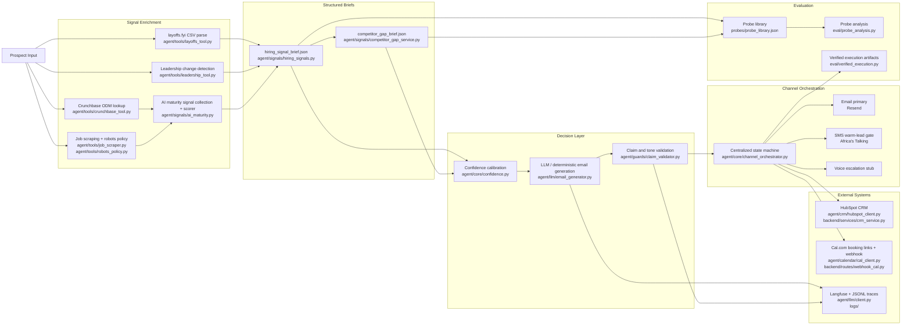

# SignalForge

SignalForge is a deterministic-first outbound system for Tenacious. It enriches a synthetic prospect from public signals, scores AI maturity, generates a competitor gap brief, writes grounded outreach, routes follow-up across email and SMS, syncs CRM and booking state, and records artifacts for evaluation.

The governing rule is simple: `the model is never the source of truth`.

## Key Artifacts

- [Audit memo](./audit_memo.md)
- [Schema](./schema.json)
- [Scoring evaluator](./scoring_evaluator.py)
- [Datasheet](./datasheet.md)
- [Methodology](./methodology.md)
- [Methodology rationale](./methodology_rationale.md)
- [Synthesis memos](./synthesis_memos/)
- [Benchmark partitions](./tenacious_bench_v0.1/)
- [Ablation results](./ablations/ablation_results.json)
- [Held-out traces](./ablations/held_out_traces.jsonl)
- [Evidence graph](./evidence_graph.json)
- [Week 11 status report](./reports/week11_status_report.md)
- [Reporting artifacts](./reports/)

## Week 11 Status

The repo now also contains the first working scaffold for **Tenacious-Bench v0.1**, the Week 11 benchmark and training-data path built on top of the Week 10 conversion engine.

Current Week 11 artifacts:

- `audit_memo.md`
- `schema.json`
- `scoring_evaluator.py`
- `tenacious_bench_v0.1/`
- `datasheet.md`
- `methodology.md`
- `methodology_rationale.md`
- `generation_scripts/`
- `training_data/path_b_preferences.jsonl`
- `training/run_path_b_critic.py`
- `ablations/ablation_results.json`
- `ablations/held_out_traces.jsonl`
- `synthesis_memos/`

Current benchmark snapshot:

- total tasks: `225`
- train/dev/held_out: `98 / 78 / 49`
- source modes: `69` `trace-derived`, `72` `programmatic`, `48` `multi-LLM-synthesis`, `36` `hand-authored`
- contamination violations: `0`
- Path B preference pairs: `98`
- held-out critic lift: `+48.84pp` over the static heuristic baseline, with `95% CI [34.88, 62.79]`

Public artifact URLs:

- Hugging Face dataset: `https://huggingface.co/datasets/ephorata/tenacious-bench-path-b-preference`
- Blog post draft: `https://github.com/nebiyuephrata/SignalForge/blob/main/publish/blog_post.md`
- Community artifact draft: `https://github.com/nebiyuephrata/SignalForge/blob/main/publish/community_issue.md`

Rebuild commands:

```bash
.venv/bin/python generation_scripts/synthesize_tasks.py
.venv/bin/python generation_scripts/build_bench.py
.venv/bin/python generation_scripts/contamination_check.py
.venv/bin/python generation_scripts/run_inter_rater_pilot.py
.venv/bin/python generation_scripts/prepare_preference_data.py
.venv/bin/python training/run_path_b_critic.py
.venv/bin/python scoring_evaluator.py --tasks tenacious_bench_v0.1/train/tasks.jsonl
.venv/bin/python scoring_evaluator.py --tasks tenacious_bench_v0.1/dev/tasks.jsonl
.venv/bin/python scoring_evaluator.py --tasks tenacious_bench_v0.1/held_out/tasks.jsonl
```

Sample evaluator invocation on a committed partition:

```bash
.venv/bin/python scoring_evaluator.py --tasks tenacious_bench_v0.1/dev/tasks.jsonl
```

Quickstart to reproduce the headline number:

```bash
.venv/bin/python generation_scripts/prepare_preference_data.py
.venv/bin/python training/run_path_b_critic.py
```

This writes `ablations/ablation_results.json`, where the current headline held-out lift is `+48.84pp`.

## Architecture



## What Lives Where

### Challenge-facing modules

- Hiring signal enrichment:
  - `agent/tools/crunchbase_tool.py`
  - `agent/tools/job_scraper.py`
  - `agent/tools/robots_policy.py`
  - `agent/tools/layoffs_tool.py`
  - `agent/tools/leadership_tool.py`
  - `agent/signals/hiring_signals.py`
- AI maturity scoring:
  - `agent/signals/ai_maturity.py`
- Competitor gap generation:
  - `agent/tools/competitor_analysis.py`
  - `agent/signals/competitor_gap_service.py`
  - `agent/signals/competitor_gap.py`
- Multi-channel orchestration:
  - `agent/core/channel_orchestrator.py`
  - `backend/routes/webhook_email.py`
  - `backend/routes/webhook_sms.py`
  - `backend/routes/webhook_cal.py`
- CRM and calendar integrations:
  - `agent/crm/hubspot_client.py`
  - `agent/calendar/cal_client.py`
  - `backend/services/crm_service.py`
  - `backend/services/conversation_service.py`

### Top-level folder index

- `agent`: core domain logic for signals, scoring, orchestration, providers, guards, and LLM integration.
- `backend`: FastAPI entrypoints, schemas, and service wiring.
- `configs`: YAML config for thresholds, model labels, and signal weights.
- `data`: deterministic local fixtures used by enrichment modules.
- `demo`: demo notes and walkthrough assets.
- `docs`: architecture, evaluation notes, and verified execution evidence.
- `eval`: adversarial execution harnesses and analysis scripts.
- `frontend`: React/Vite console for inspecting briefs, lifecycle artifacts, CRM state, and bookings.
- `logs`: JSONL traces and runtime logs.
- `method`: mechanism-design write-up for the confidence layer.
- `outputs`: generated artifacts from prospect runs and evaluations.
- `probes`: probe library, taxonomy, and target failure mode artifacts.
- `scripts`: helper entrypoints for local execution.
- `tenacious_sales_data`: seed collateral and schemas for the Tenacious scenario. Kept separate from runtime code.
- `tests`: regression coverage for signals, integrations, routing, and end-to-end flow.

## What Is Next

The remaining high-level work is publication hardening rather than more system invention:

1. complete the true 24-hour inter-rater rerun for the public release,
2. normalize the remaining dimension-label drift in the benchmark rows,
3. run the intended small-backbone Path B training pass beyond the local linear critic,
4. publish the dataset and critic artifacts on HuggingFace,
5. finalize the public memo, blog post, and community artifact.

## License And Credits

Repository license:

- [`LICENSE`](./LICENSE)

Attribution:

- Tenacious scenario collateral lives under [`tenacious_sales_data/`](./tenacious_sales_data/)
- Week 11 benchmark and training artifacts were assembled from local traces, probe definitions, seeded collateral, and synthesis scripts committed in this repo
- External paper influences are summarized in [`methodology_rationale.md`](./methodology_rationale.md) and [`synthesis_memos/`](./synthesis_memos/)

## Setup

### 1. Prerequisites

- Python `3.12`
- Node.js `18+`
- npm `9+`
- optional: Playwright Chromium for local browser-backed parsing

### 2. Create the Python environment

```bash
python3 -m venv .venv
source .venv/bin/activate
.venv/bin/pip install -r requirements.txt
```

Pinned backend/runtime dependencies are in [`requirements.txt`](./requirements.txt):

- `fastapi==0.115.0`
- `uvicorn==0.30.1`
- `pydantic==2.8.2`
- `pydantic-settings==2.3.4`
- `httpx==0.27.0`
- `langchain==0.3.0`
- `langfuse==2.44.0`
- `redis==5.0.7`
- `sqlalchemy==2.0.32`
- `python-dotenv==1.0.1`
- `pyyaml==6.0.2`
- `playwright==1.52.0`
- `pytest==8.3.2`

Optional browser dependency:

```bash
.venv/bin/python -m playwright install chromium
```

### 3. Frontend dependencies

```bash
cd frontend
npm install
cd ..
```

### 4. Environment variables

Create `.env` from `.env.example` when available. SignalForge reads settings from `agent/utils/config.py`.
If provider credentials are missing, SignalForge degrades safely: LLM email generation falls back to deterministic copy, CRM writes return explicit offline fallback payloads, and channel sends return structured provider failures instead of raising opaque exceptions.

#### Core app

- `APP_NAME`: FastAPI app name
- `APP_ENV`: environment label
- `APP_HOST`: bind host
- `APP_PORT`: bind port
- `BASE_URL`: public URL for the deployed backend, used for deployment-safe examples and public callbacks
- `LOG_LEVEL`: logger level
- `FRONTEND_ORIGINS`: allowed frontend origins, comma-separated
- `FRONTEND_ORIGIN_REGEX`: optional regex override for CORS; in non-production local/LAN dev origins are allowed by default

#### LLM / observability

- `OPENROUTER_API_KEY`: live model access
- `OPENROUTER_BASE_URL`: OpenRouter endpoint
- `OPENROUTER_MODEL`: primary model, defaulting to `google/gemini-2.5-flash`
- `OPENROUTER_FALLBACK_MODEL`: secondary model, defaulting to `qwen/qwen3-32b`
- `OPENROUTER_TIMEOUT_SECONDS`: timeout for model calls
- `OPENROUTER_MAX_TOKENS`: token cap
- `LANGFUSE_PUBLIC_KEY`: Langfuse public key
- `LANGFUSE_SECRET_KEY`: Langfuse secret key
- `LANGFUSE_HOST`: Langfuse host URL

#### Email integration

- `RESEND_API_KEY`: Resend credential
- `RESEND_API_BASE_URL`: Resend API base URL
- `RESEND_FROM_EMAIL`: sender identity
- `RESEND_REPLY_TO`: reply target
- `RESEND_WEBHOOK_SECRET`: reserved for webhook verification
- `STAFF_SINK_EMAIL`: optional safety sink so test emails do not hit real buyers

Responsibilities:

- send outbound email
- accept inbound provider webhook payloads
- carry company/contact metadata into lifecycle state

Relevant files:

- `agent/channels/email/resend_client.py`
- `agent/channels/email/email_handler.py`
- `backend/routes/webhook_email.py`

#### SMS integration

- `AFRICAS_TALKING_API_KEY`: Africa's Talking credential
- `AFRICAS_TALKING_USERNAME`: account username
- `AFRICAS_TALKING_BASE_URL`: provider base URL
- `AFRICAS_TALKING_WEBHOOK_SECRET`: reserved for webhook verification

Responsibilities:

- send warm-lead SMS only after recorded email reply
- accept inbound SMS replies
- write channel events back through the centralized orchestrator

Relevant files:

- `agent/channels/sms/africas_talking_client.py`
- `agent/channels/sms/sms_handler.py`
- `backend/routes/webhook_sms.py`
- `agent/core/channel_orchestrator.py`

#### HubSpot CRM integration

- `HUBSPOT_ACCESS_TOKEN`: preferred credential
- `HUBSPOT_API_KEY`: legacy fallback
- `HUBSPOT_BASE_URL`: HubSpot API base URL

Responsibilities:

- upsert contact
- write enrichment fields
- write conversation and booking activities
- auto-create missing `signalforge_*` properties when possible

Relevant files:

- `agent/crm/hubspot_client.py`
- `backend/services/crm_service.py`

#### Cal.com integration

- `CAL_API_KEY`: reserved for future authenticated actions
- `CALCOM_BASE_URL`: public booking base URL
- `CALCOM_BOOKING_SLUG`: discovery call slug
- `CALCOM_WEBHOOK_SECRET`: reserved for webhook verification

Responsibilities:

- generate booking link included in outreach
- accept booking-completed webhook
- update lifecycle state and CRM enrichment after booking

Relevant files:

- `agent/calendar/cal_client.py`
- `agent/calendar/booking_flow.py`
- `backend/routes/webhook_cal.py`

#### Reserved infra

- `REDIS_URL`: future workflow state backend
- `DATABASE_URL`: future durable workflow state backend

## Run Order

When a new engineer wants the least surprising local bootstrap, use this order:

1. Create `.venv` and install Python dependencies.
2. Install frontend dependencies in `frontend/`.
3. Optionally install Playwright Chromium.
4. Start the backend:

```bash
.venv/bin/uvicorn backend.main:app --host 0.0.0.0 --port 10000
```

5. Start the frontend in a second shell:

```bash
cd frontend
npm run dev
```

6. Verify health:

```bash
curl -sS "$BASE_URL/health"
```

7. Run a prospect:

```bash
curl -sS -X POST "$BASE_URL/run-prospect"
```

8. Run the rubric-friendly synthetic lifecycle:

```bash
curl -sS -X POST "$BASE_URL/run-prospect/demo-flow"
```

9. Run the public validation demo endpoint:

```bash
curl -sS -X POST "$BASE_URL/demo/run-live" \
  -H 'Content-Type: application/json' \
  -d '{"company_name":"Northstar Lending","contact_email":"cto@northstar.example"}'
```

10. If you want the multi-channel path manually:

```bash
curl -sS -X POST "$BASE_URL/webhooks/email/send" \
  -H 'Content-Type: application/json' \
  -d '{"company_name":"Northstar Lending","contact_email":"cto@northstar.example","contact_name":"Maya","phone_number":"+15551234567"}'
```

Then post an inbound reply:

```bash
curl -sS -X POST "$BASE_URL/webhooks/email/resend/events" \
  -H 'Content-Type: application/json' \
  -d '{"type":"email.reply_received","data":{"id":"evt-1","email_id":"email-123","to":"cto@northstar.example","text":"Yes, send the link.","tags":[{"name":"company_name","value":"Northstar Lending"}]}}'
```

Then SMS warm follow-up:

```bash
curl -sS -X POST "$BASE_URL/webhooks/sms/send-warm" \
  -H 'Content-Type: application/json' \
  -d '{"company_name":"Northstar Lending","contact_email":"cto@northstar.example","phone_number":"+15551234567","body":"Thanks for the reply. Here is the shortest next step."}'
```

Then booking completion:

```bash
curl -sS -X POST http://127.0.0.1:8000/webhooks/cal/booking-completed \
  -H 'Content-Type: application/json' \
  -d '{"company_name":"Northstar Lending","contact_email":"cto@northstar.example","booking_id":"booking-1","booking_url":"https://cal.com/signalforge-discovery/booking-1","meeting_start":"2026-04-28T15:00:00Z"}'
```

10. Run tests:

```bash
.venv/bin/python -m pytest -q
```

## What the Signal Pipeline Does

### Hiring signal brief

`agent/signals/hiring_signals.py` builds the merged `hiring_signal_brief` by calling these concrete modules:

- Crunchbase ODM lookup with funding-window filter:
  - `CrunchbaseTool.lookup_company_record`
  - `CrunchbaseTool.lookup_recent_funding_event`
- Job scraping:
  - `JobScraper.scrape_company_jobs`
  - `JobScraper._scrape_company_careers_page`
  - `JobScraper._scrape_public_board`
  - `PublicPageRobotsPolicy.decision_for`
- layoffs.fyi parsing:
  - `LayoffsTool.parse_layoffs_fyi_csv`
  - `LayoffsTool.get_recent_layoffs`
- Leadership change detection:
  - `LeadershipChangeTool.detect_public_leadership_changes`
  - `LeadershipChangeTool.get_recent_changes`

Explicit edge-case handling exists in source for:

- missing Crunchbase record
- no recent funding inside the buying window
- zero open roles
- no layoffs in the lookback window
- no leadership change in the lookback window
- missing careers fixture
- robots/public-page gated board sources

### AI maturity scoring

`agent/signals/ai_maturity.py` exposes the challenge-facing scorer in two steps:

1. `collect_ai_maturity_inputs(...)`
2. `score_ai_maturity_inputs(...)`

The scorer visibly:

- ingests all six signal categories
- assigns high/medium/low weight tiers
- computes `weighted_points`
- maps to integer `0..3`
- returns separate `confidence`
- emits per-signal justification
- handles silent-company / missing-company cases without over-claiming

### Competitor gap brief

`agent/signals/competitor_gap_service.py` now owns the full benchmark flow:

- select 5-10 same-sector, similar-size competitors
- re-score each with the same AI maturity scorer
- compute distribution position
- identify top-quartile peers
- extract 2-3 public-signal-backed gap findings
- handle sparse sectors explicitly

## Output Artifacts

SignalForge writes inspectable artifacts to `outputs/` and `logs/`:

- `outputs/hiring_signal_brief.json`
- `outputs/competitor_gap_brief.json`
- `outputs/email.json`
- `outputs/channel_plan.json`
- `outputs/full_prospect_run.json`
- `outputs/verified_run.json`
- `outputs/confidence_comparison.json`
- `outputs/probe_results.json`
- `outputs/adversarial_batch_summary.json`
- `logs/prospect_runs.jsonl`
- `logs/conversation_events.jsonl`
- `logs/claim_validation_failures.jsonl`

## Limitations and Next Steps

These are the concrete handoff items a new engineer will hit:

1. Live scraping is still fixture-backed.
   - Today: company careers pages can parse local HTML fixtures, while BuiltIn, Wellfound, and LinkedIn stay explicitly gated in `agent/tools/robots_policy.py`.
   - Next step: record real public URLs per company, store a real robots decision, and only enable browser fetches when the page is allowed.

2. GitHub-org AI maturity signals are structurally supported but not populated by the local dataset.
   - Today: `collect_ai_maturity_inputs(...)` scores the category and reports the absence.
   - Next step: add fixture fields such as `github_org_activity` and `github_org_url`, or wire a real public GitHub collector.

3. Leadership change detection currently reads synthetic Crunchbase/public-press fixture records.
   - Today: `LeadershipChangeTool.detect_public_leadership_changes(...)` merges both record types if present.
   - Next step: extend fixtures with explicit press records or connect a real public press source.

4. CRM and calendar webhooks do not yet verify signatures.
   - Today: the secret env vars exist, but runtime verification is not enforced.
   - Next step: validate Resend, Africa's Talking, and Cal.com webhook signatures in the route layer.

5. Workflow state is file-backed.
   - Today: `agent/core/state_manager.py` persists to JSON for local determinism.
   - Next step: replace with Redis or Postgres-backed state plus optimistic locking.

6. Live LLM and Langfuse depend on external network reachability.
   - Today: the system falls back cleanly when outbound DNS/network is unavailable.
   - Next step: verify outbound HTTPS, rerun `eval/verified_execution.py`, and capture new real-run artifacts.

## Related Docs

- [DIRECTORY_INDEX.md](./DIRECTORY_INDEX.md)
- [HANDOFF_NOTES.md](./HANDOFF_NOTES.md)
- [docs/system_architecture.md](./docs/system_architecture.md)
- [docs/evidence/real_run.md](./docs/evidence/real_run.md)
